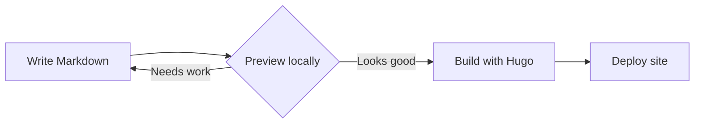
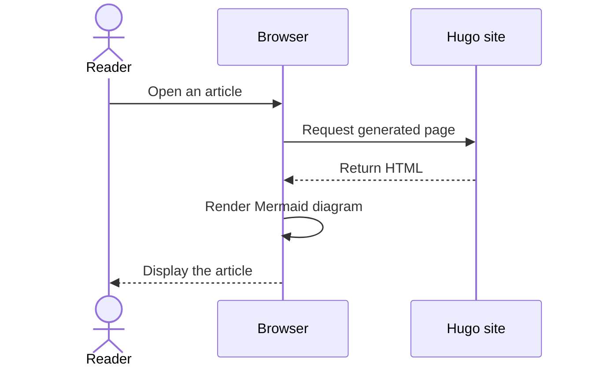

Mermaid diagrams can live beside prose as ordinary fenced code blocks. The
theme loads Mermaid only when a page contains at least one diagram.

## Publishing workflow

This flowchart shows a small documentation pipeline:

## Request lifecycle

Sequence diagrams are useful for documenting interactions between services:

The same blocks follow the selected light or dark color palette.
